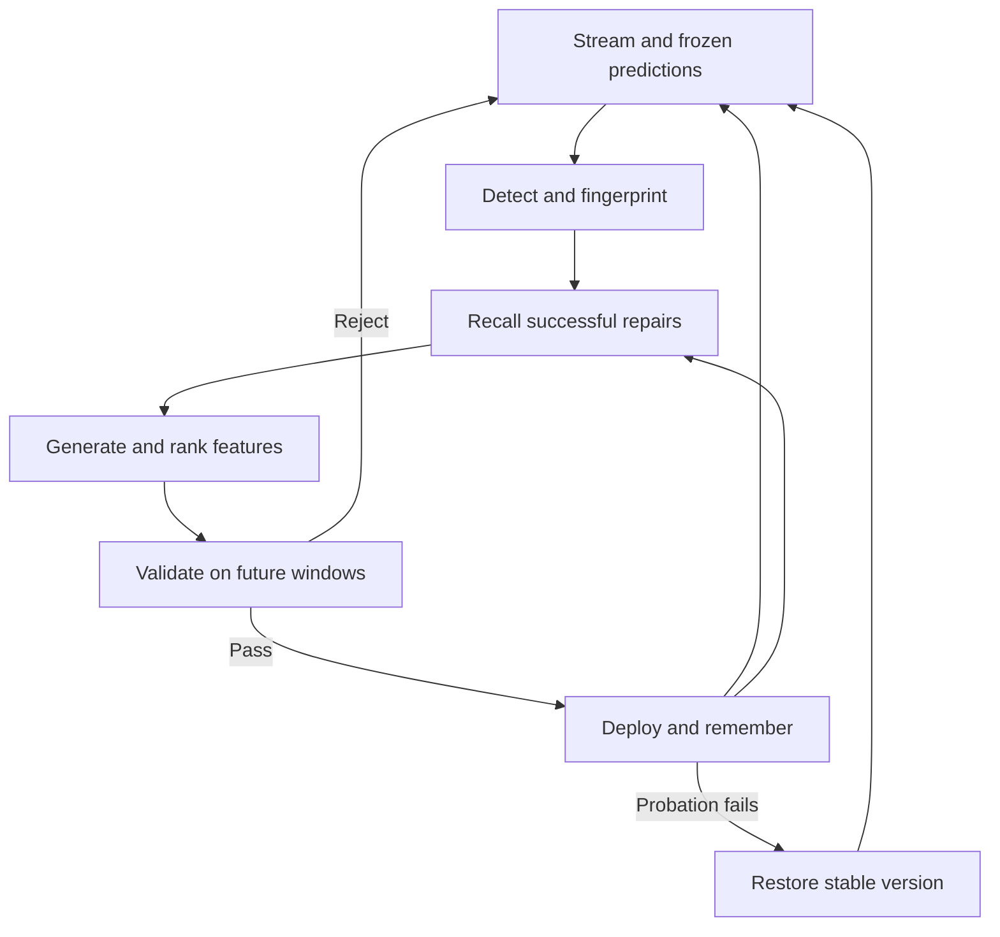

# SEEF — Self-Evolving Feature Engineering Framework

The UI has three views: Overview, Process, and Results. Both runtimes implement the same core adaptation loop. The browser runs locally without a backend; the Python dashboard uses its own research engine.

Production and shadow candidates consume identical raw samples and predict before labels are processed. The classifier weights stay fixed. Memory informs candidate priority but does not bypass deployment checks.

The Process visualizer is an observation layer. In the browser, `process.js` captures immutable summaries of engine events and completed windows: pipeline stage, fingerprint, memory matches, candidates, scores, checks, active feature, and version. It retains the latest 600 checkpoints. Replay reads these snapshots without changing the stream, retraining a model, or repeating an experiment. `engine.export()` includes the recorded trace.

Python displays current engine and event state through `dashboard/core_view.py`. SQLite stores successful episodes; Streamlit session state holds the current run. Recorded checkpoint replay is browser-only.

Contextual ranking, bounded transforms, versioning, rollback, and conservative internal metadata pruning remain implementation details. Advanced parameters and ablation experiments remain available through configuration and the command line.
